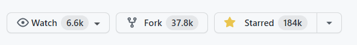

# React là gì?


> Là 1 thư viện được JavaScript để xây dựng những giao diện người dùng (UI)

-   React hay còn được biết với cái tên React.js hoặc ReactJS
-   Website: https://reactjs.org/
-   Github: https://github.com/facebook/react
-   Stars: 154k
-   Version: 17.0.2 (22/03/2021)
-   Owned by: Facebook
-   License: MIT
    

    > 1 framework là một tập hợp các library đầy đủ tính năng sẵn sàng phát triển web

-   Dùng để làm web nhanh hơn, tốt hơn và hiệu quả hơn.
-   Là một trong những thư viện phổ biến nhất hiện nay trong việc xây dựng giao diện người dùng.
-   Các đối thủ của ReactJS: VueJS, Angular, Svelte, ...

```
✅ React là một library chứ không phải là 1 framework
```

## Các thư viện sử dụng kết hợp React

-   Router: `react-router-dom`
-   Form: `react-hook-form`, formik, redux-form,...
-   Schema validation: `Joi`, Yup,...
-   State management: `Redux`, Recoil,...
-   i18n: `react-i18next`
-   ...

## Các công ty lớn sử dụng React

-   Facebook
-   Twitter
-   Netflix
-   WhatsApp
-   Dropbox
-   ...


🌐 Link tham khảo:

-   So sánh giữa React, Angular và Vue: https://www.codeinwp.com/blog/angular-vs-vue-vs-react
