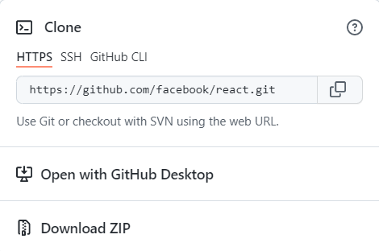

# 2 cách để clone một git repository 🎉



## Dùng HTTPS

```
git clone https://github.com/thanhthido/repo-name.git
```

-   Đơn giản, `dễ sử dụng`.
-   Ít bị chặn bởi firewall.

Tuy nhiên:

-   `Phải nhập tài khoản, mật khẩu` Github mỗi khi làm việc với Git repository.
-   Nếu không muốn phải nhập đi nhập lại mật khẩu thì phải cache credentials của Git lại.

## Dùng SSH (cá nhân thích dùng)

```
git clone git@github.com:thanhthido/repo-name.git
```

-   Không cần phải nhập tài khoản, mật khẩu --> tiết kiệm thời gian

Tuy nhiên:

-   Setup hơi phức tạp nếu bạn không quen sử dụng terminal.
-   Hay bị chặn bời firewall.

🌐 Link tham khảo

-   https://docs.github.com/en/github/using-git/why-is-git-always-asking-for-my-password
-   https://docs.github.com/en/github/using-git/caching-your-github-credentials-in-git
-   https://www.toolsqa.com/git/ssh-protocol/
