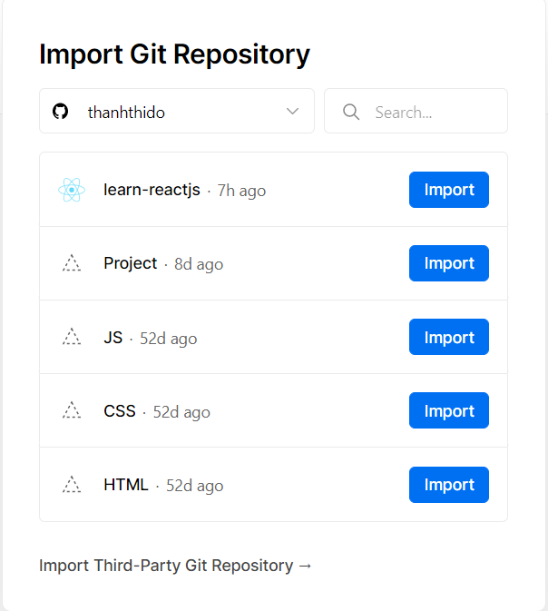
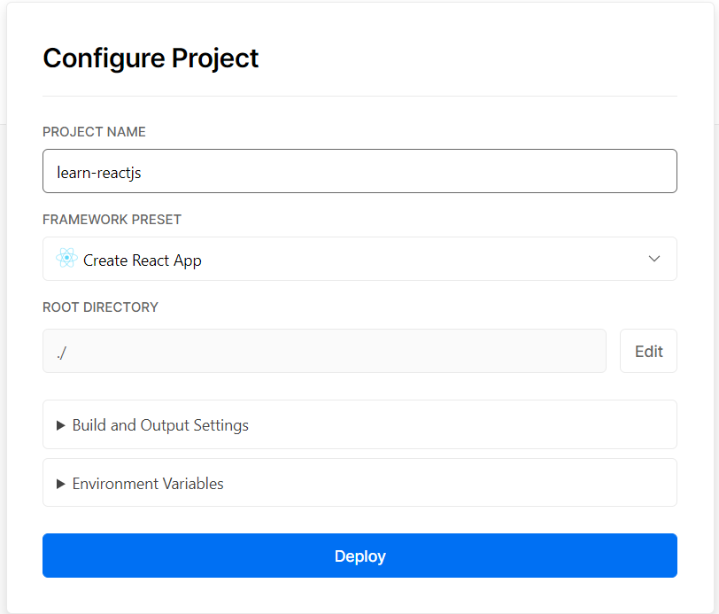

# Deploy Github repository lên Vercel

## 1. Đăng nhập Vercel với tài khoản Github

Đi tới đường link: https://vercel.com/login và click nút `Continue with Github`

Sau đó xác nhận cấp quyền cho Vercel truy cập vào các repository trên Github của mình.

## 2. Import project từ Github

Tại trang điều khiển của vercel https://vercel.com/dashboard, click nút `New Project`.

Nó sẽ tới đường dẫn như bên dưới.

Click `Import` vào repository nào bạn muốn import vào Vercel

Tiếp đến là config build, nhưng cái hay của Vercel là nó tự động detect được project mình sử dụng build tool nào và tự động config dùm, yeahhh 🎉

Nên chỗ này, mình chỉ việc click nút `Deploy` là xong.

Đợi một lát, Vercel build và deploy xong thì sẽ thấy một thông báo dạng thế này là OK.

Bạn có thể click `Visit` để truy cập vào trang web của mình mới deploy xong.

🌐 Link tham khảo

-   https://vercel.com/github
-   https://vercel.com/docs/git-integrations/vercel-for-github
