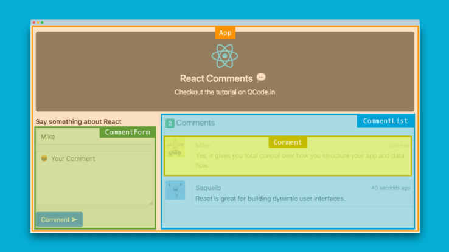

# Component là gì?

Một giao diện lớn, phức tạp được chia thành nhiều thành phần UI nhỏ hơn (component) để dễ quản lý và tái sử dụng.



## Phân loại component

### 1. Chia theo cú pháp: `Functional` và `Class` component

**CLASS COMPONENT**: dạng đối tượng

```js
import React, { PureComponent } from 'react'
class App extends PureComponent {
    render() {
        return <div>ReactJS is sexy! :P</div>
    }
}
export default App
```

**FUNCTIONAL COMPONENT** (recommended): dạng Function

```js
import React, { PureComponent } from 'react'
import React from 'react'
function App(props) {
    return <div>ReactJS is easy to learn :P</div>
}
export default App
```

### 2. Chia theo chức năng: `Container` và `Presentational` component

 
|Container component|Presentational component|
|:------------------|:-----------------------|
|Có dữ liệu nhưng không biết cách render|Không biết dữ liệu nhưng biết cách render|
|stateful|stateless|
|quan tâm dữ liệu gì|quan tâm hiển thị như thế nào|
|không biết hiển thị gì|không biết dữ liệu từ đâu ra|
|ruyền dữ liệu xuống presentational component|nhận dữ liệu từ container|

🌐 Link tham khảo:

-   Tìm hiểu về component trong ReactJ: https://reactjs.org/docs/react-component.html
