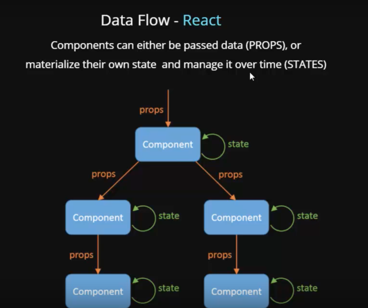

# Props vs State

- Truyền dữ liệu `từ cha xuống con`: **Props**
- Truyền dữ liệu `giữa component ngang hàng`: để **state trên component cha**, rồi từ cha truyền
  ngược xuống component con.
- Truyền dữ liệu `giữa các trang khác nhau`: dùng Redux.

