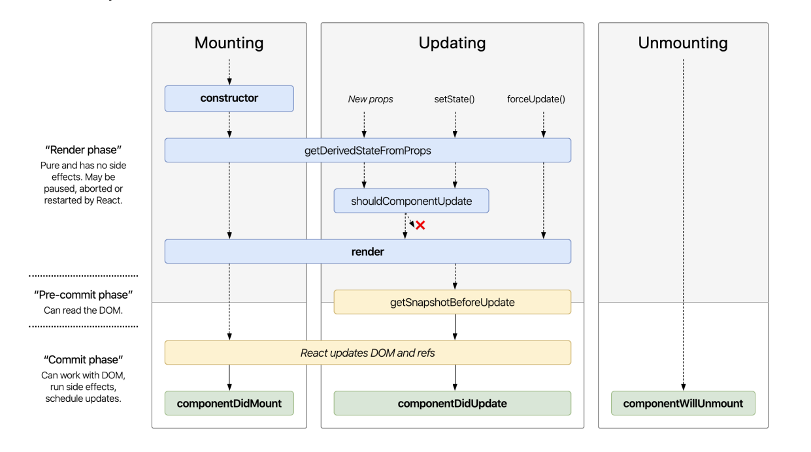
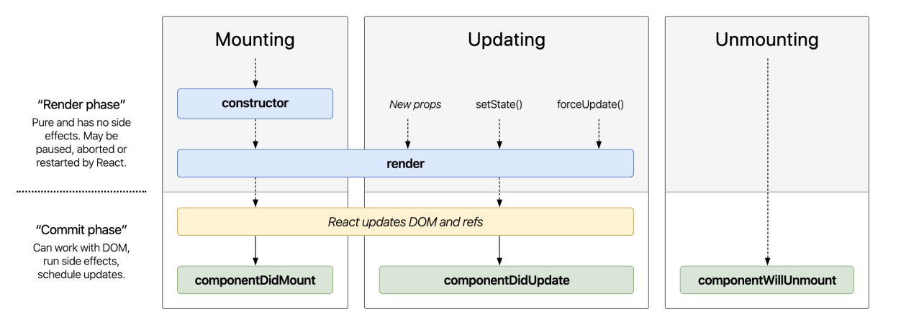

# ReactJS - Component life cycle

> Life cycle = Vòng đời

## Life cycle của component trong ReactJS là gì?

Với component trong `ReactJS`, life cycle gồm 3 giai đoạn:

- Được tạo ra (`Mounting`)
- Qua nhiều thay đổi (`Updating`)
- Và bị huỷ bỏ (`Unmounting`)

ReactJS life cycle (full version)

Link component life cycle diagram: http://projects.wojtekmaj.pl/react-lifecycle-methods-diagram/

Bảng life cycle rút gọn (nên dùng cái này)

📝 Không sử dụng các life cycle này nữa:

- `componentWillMount()`
- `componentWillReceiveProps()`

❓ Component vs PureComponent

- Nên dùng `PureComponent`
- Vì có shallow comparison trong hàm `shouldComponentUpdate()`
- Link tham khảo: https://stackoverflow.com/questions/41340697/react-component-vs-reactpurecomponent/53740921

# 📝 Túm lại, nhớ nè

- Cần refactor lại code nếu có đang dùng
  - `componentWillMount()`
  - `componentWillReceiveProps()`
- Chỉ sử dụng các life cycle sau:
  - `constructor()`
  - `componentDidMount()`
  - `componentWillUnmount()`
- Cực kì hạn chế sử dụng componentDidUpdate()
