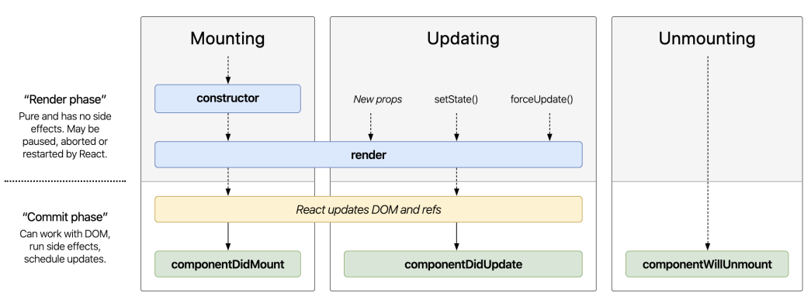

# Component Life Cycles

Bảng life cycle rút gọn (nên dùng cái này)



**constructor()**

- Được phép dùng.
- Nhớ có super(props)
- Khai báo state.
- Định nghĩa properties của component.

```js
class App extends PureComponent {
	constructor(props) {
		super(props)
		this.DEFAULT_MAX_LENGTH = 10 // Khai báo thuộc tính
		this.state = {
			productList: [], // khai báo state
		}
	}
}
```
