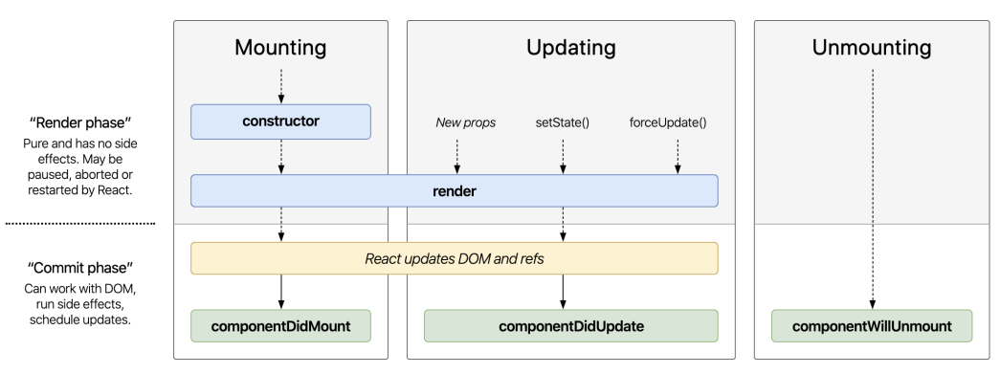

# Component Life Cycles

Bảng life cycle rút gọn (nên dùng cái này)

**componentDidUpdate()**

- Nằm trong phase updating: Có thể diễn ra ít nhất là 0 lần, hoặc vô số lần
- Quá trình update sẽ diễn ra mỗi khi có props, states thay đổi, hoặc force update (bắt buộc thay đổi)
- Không nên sử dụng `setState()` trong componentDidUpdate()

- `Cực kỳ hạn chế` dùng
- `ADVANCE` Chỉ dùng nếu muốn handle update component khi click nút back mà trên url có query params
