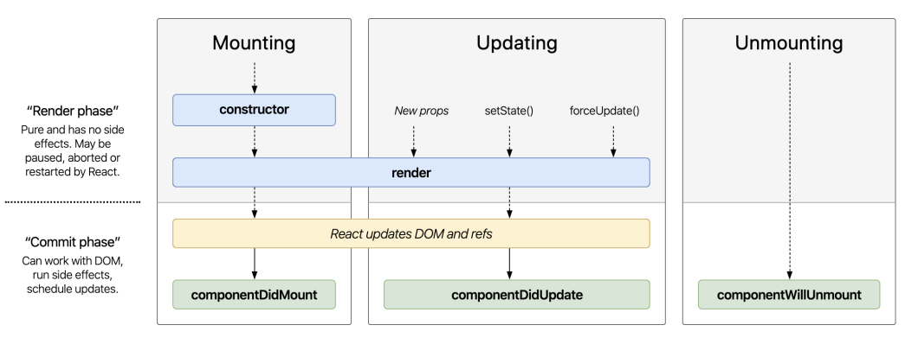
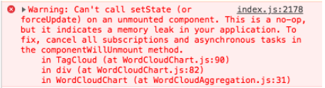

# Component Life Cycles

Bảng life cycle rút gọn (nên dùng cái này)



**Lỗi can't setState() on unmounted component**



✅ Giải pháp

- Dùng một flag `isComponentMounted` để biết trạng thái của component.

```js
class Home extends PureComponent {
	constructor(props) {
		super(props)
		this.isComponentMounted = false
		this.state = {
			productList: [],
		}
	}
	async componentDidMount() {
		this.isComponentMounted = true
		try {
			const productList = await productApi.fetchProductList()
			if (this.isComponentMounted) {
				this.setState({ productList })
			}
		} catch (error) {
			console.log('Failed to fetch data:', error)
		}
	}
	componentWillUnmount() {
		this.isComponentMounted = false
	}
	render() {
		// Render something here ...
	}
}
```
