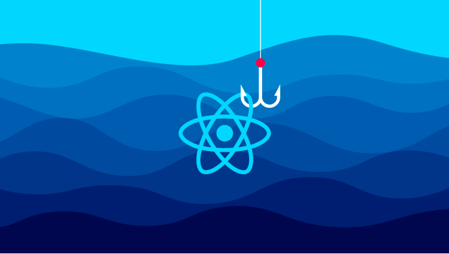
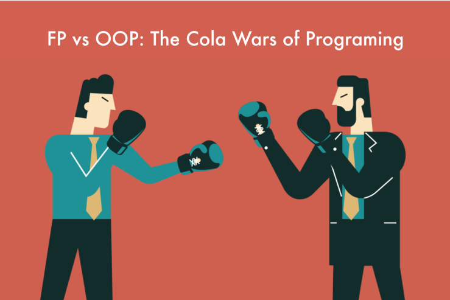

# Giới thiệu tổng quan về React Hooks



1. React hooks là gì? (what)
2. Khi nào dùng hooks? (when)
3. Ai thích sử dụng hooks? (who)
4. Tại sao nên dùng hooks? (why)
5. Sử dụng hooks như thế nào? (how)
6. ❓ React hooks sinh ra để bỏ đi class component, đúng hay sai?
7. ❓ Có nên viết lại code life cycle thành hooks không?
8. Nói nhiều quá, code tí thử coi!

## 1. React hooks là gì? (what)

- Feature mới được add vào từ version 16.8 của React.
- Giúp mình có thể dùng state, life cycle và các features khác của React mà không cần dùng tới class.
- Hooks có thể hiểu nôm na là một cái function được hook-into vào các features của React và sẽ được
  gọi khi cần thiết.
- Mặt mũi nó trông ra làm sao?

```js
function ColorBox(props) {
	const [color, setColor] = useState('deeppink')
	function handleBoxClick() {
		const randomColor = getRandomColor()
		setColor(randomColor)
	}
	return (
		<div className='color-box' style={{ backgroundColor: color }} onClick={handleBoxClick}></div>
	)
}
```

## 2. Khi nào dùng hooks? (when)

- Khi muốn dùng state, life cycle, ... mà không thích làm việc với class (OOP).
- **NHỚ**: Chỉ sử dụng được cho functional component, không dùng cho class.

## 3. Ai thích sử dụng hooks? (who)

- OOP vs FP (cuộc chiến không hồi kết thúc)
- Không thể là ai khác ngoài tín đồ của Functional Programming.



## 4. Tại sao nên dùng hooks? (why)

- No breaking changes.
- Có thể dùng vừa class component cũ, vừa dùng thử nghiệm react hooks cho component mới.
- Loại bỏ rào cản OOP. (this, super(props), ...)
- Không có kế hoạch để bỏ class component.
- Không xoá bỏ kiến thức bạn đã biết về React: state, life cycles, context, ...

## 5. Sử dụng hooks như thế nào? (how)

Giới thiệu series về react hooks của mình:

- Lý thuyết về các loại hooks hay dùng
- Ví dụ minh hoạ
- Code cùng các bạn

Các chủ đề dự định sẽ trao đổi với các bạn

- useState()
- useEffect()
- useContext()
- useReducer()
- useSelector(), useDispatch()
- Chia sẻ logic giữa các component với custom hooks.
- ...

## 6. ❓React hooks sinh ra để bỏ đi class component, đúng hay sai?

- SAI.
- React hooks không có bỏ những kiến thức mà bạn đã biết về React như: state, life cycle, props, ...
- Không có kế hoạch để bỏ class component

## 7. ❓Có nên viết lại code life cycle thành hooks không?

- Tuỳ các bạn. Nhưng khuyến khích là không nên.
- Chỉ refactor lại những component quá phức tạp.
- Thử nghiệm với component mới

📝 Các bạn nhớ nè

- Hooks có từ version 16.8 của React
- Hooks sinh ra để mình dùng các features của React như state, life cycle mà không cần dùng class.
- Hooks không xoá bỏ đi các khái niệm, kiến thức bạn đã biết về React.
- Không cần viết lại tất cả code thành hooks.

🌐 Link tham khảo

- Introduction to react hooks: https://reactjs.org/docs/hooks-intro.html
- React hooks API reference: https://reactjs.org/docs/hooks-reference.html
- React hooks FAQ: https://reactjs.org/docs/hooks-faq.html
