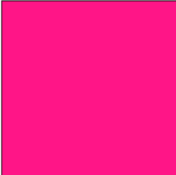
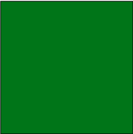

# useState() lab - ColorBox

## Bài tập 1: ColorBox

Tạo một component `ColorBox`, có background mặc định màu `deeppink`.

1. Khi click lên box, đổi background ngẫu nhiên thành một trong các màu

```js
;['deeppink', 'green', 'yellow', 'black', 'blue']
```

|  | <--click--> |  |
| :---------------------------: | :---------: | :-------------------: |

2. Giữ màu background của box sau khi reload trình duyệt

---

## Phân tích

**Câu 1:**

ColorBox

- Props: N/A
- State: `color (background color)`
- Render: `div.color-box with backgroundColor = color`
- Handle onClick: đổi màu sang một trong các màu trong danh sách được cung cấp.

  **Câu 2:**

- Lưu ý, chưa dùng `useEffect()` hook
- Mỗi lần đổi màu, lưu vào trong `localStorage`.
- Set `initialState` của color là giá trị từ trong `localStorage`.
- Sử dụng `callback initialState` để chỉ thực hiện một lần.

Happy Coding! 💻 ❤
